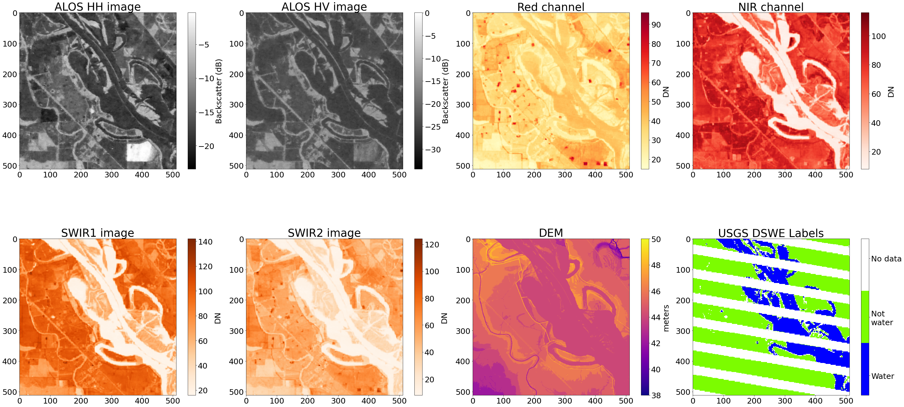

## Overview
This repository provides the python code associated with the IGARSS presentation "Harmonizing SAR and optical data to map surface water extent: a deep learning approach"

In this repository, we demonstrate how optical data can improve inferences of surface water extent from SAR sensors. We demonstrate this by training a neural network on data from the ALOS-1 PALSAR instrument, along with annually-aggregated cloud-free optical images from the Landsat mission that is generated as part of the [Global Forest Change](https://storage.googleapis.com/earthenginepartners-hansen/GFC-2020-v1.8/) project. We use the USGS [Dynamic Surface Water Extent (DSWE) data product](https://www.usgs.gov/landsat-missions/landsat-collection-2-level-3-dynamic-surface-water-extent-science-product) as the source of our labels.

## Environment
This repository contains all of the code needed to download datasets, create training chips, train models, and perform inferences on new scenes. An `environment.yml` file is provided to install all of the required dependencies into a separate conda/mamba environment, which can be created by the following command:

    mamba env create -f environment.yml

This creates the environment `dl-with-alos-dswe` and are used to run the notebooks contained in this repository.

## 1. Start here - Downloading ALOS and USGS DSWE datasets
The `0-Download-USGS-DSWE.ipynb` notebook is the first notebook that needs to be executed. This notebook queries the ASF DAAC as well as the USGS to download overlapping ALOS and DSWE data. In particular, we are looking for ALOS images over the United States and overlapping DSWE data that are within 1 day of the ALOS acquisition. We discard any pairs of ALOS and DSWE images if more than 30% of the DSWE image contains clouds, or if more than 50% of the data overlapping the ALOS image is `no data`. Lastly, we ensure that each DSWE image contains at least 5% water within the ALOS acquisition bounds.

## 2. Downloading ancillary data and Generating Training Data
Once the ALOS and DSWE data have been downloaded, we download overlapping GFC and Height Above Nearest Drainage (HAND) data. The DEM data is obtained as part of the SAR data downloads from the ASF DAAC. Then, we cut up each scene and associated labels into 512x512 pixel chips. Then we have a dataset in the following format: 

                                               
                                                   INPUT DATA              TRAINING LABEL
                                                   ----------              --------------
                                                    HH chip
                                                    HV chip
                                                    Red chip
                                                    NIR chip         ->      DSWE chip
                                                    SWIR1 chip
                                                    SWIR2 chip
                                                    DEM chip
                                                    HAND chip

Here is an example: 

This dataset can be generated by running the `1-Create-training-data.ipynb` notebook. When successfully executed, the notebook produces the training samples from the ALOS scenes, as well as a CSV file containing paths to the training samples.

## 3. Model Training
We train a convolutional neural network to genrate surface water extent from our input data. Since we are interested in image segmentation (pixel-wise Water/Not-water classification) we use the [U-Net](https://arxiv.org/pdf/1505.04597.pdf%EF%BC%89) architecture, along with a ResNet encoder. 

## Model weights
