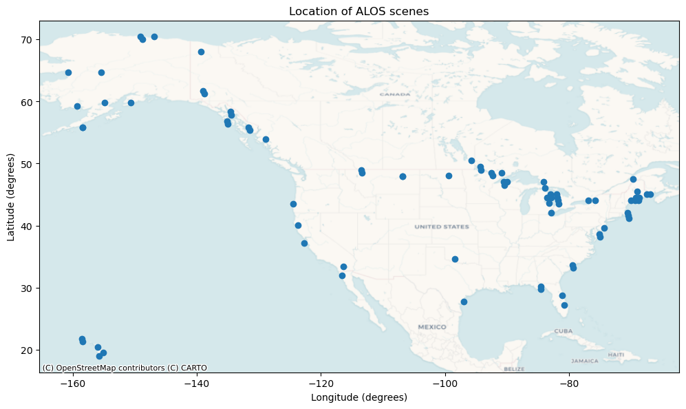
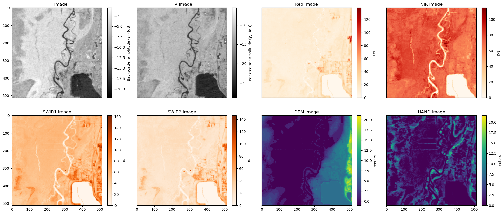
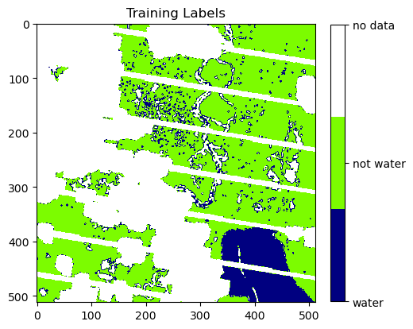

## Overview
This repository provides the python code associated with the IGARSS presentation "Harmonizing SAR and optical data to map surface water extent: a deep learning approach"

In this repository, we demonstrate how optical data can improve inferences of surface water extent from SAR sensors. We demonstrate this by training a neural network on data from the ALOS-1 PALSAR instrument, along with annually-aggregated cloud-free optical images from the Landsat mission that is generated as part of the [Global Forest Change](https://storage.googleapis.com/earthenginepartners-hansen/GFC-2020-v1.8/) project. We use the USGS [Dynamic Surface Water Extent (DSWE) data product](https://www.usgs.gov/landsat-missions/landsat-collection-2-level-3-dynamic-surface-water-extent-science-product) as the source of our labels.

## Environment
This repository contains all of the code needed to download datasets, create training chips, train models, and perform inferences on new scenes. An `environment.yml` file is provided to install all of the required dependencies into a separate conda/mamba environment, which can be created by the following command:

    mamba env create -f environment.yml

This creates the environment `dl-with-alos-dswe` and are used to run the notebooks contained in this repository. The notebooks referred to in the below sections can be found within the `notebooks/model-weights` folder.

## 1. Start here - Downloading ALOS and USGS DSWE datasets
The `0-Download-USGS-DSWE.ipynb` notebook demonstrates how to search and download ALOS and DSWE data that can be used to train our model. This notebook queries the ASF DAAC as well as the USGS to download overlapping ALOS and DSWE data. In particular, we are looking for ALOS images over the United States and overlapping DSWE data that are within 1 day of the ALOS acquisition. We discard any pairs of ALOS and DSWE images if more than 30% of the DSWE image contains clouds, or if more than 50% of the data overlapping the ALOS image is `no data`. Lastly, we ensure that each DSWE image contains at least 5% water within the ALOS acquisition bounds. NOTE: This notebook will take a significant amount of time to execute, as a lot of time is spent in querying the DAACs and filtering out datasets that do not contain enough usable information. For convenience, we provide a pre-compiled list of ASF granules and USGS DSWE tiles that can be directly queried and downloaded from the appropriate DAACs. The notebook `0b-Download-data.ipynb` demonstrates this, and it is recommended that users start with this notebook.

Here is a map of the locations for downloaded ALOS and DSWE data:

  

The input image stack consists of these following channels - 

## 2. Downloading ancillary data and Generating Training Data
Once the ALOS and DSWE data have been downloaded, we download overlapping GFC and Height Above Nearest Drainage (HAND) data. The DEM data is obtained as part of the SAR data downloads from the ASF DAAC. Then, we divide each scene and associated labels into 512x512 pixel non-overlapping chips. Then we have a dataset in the following format: 

                                    
                            INPUT DATA              TRAINING LABEL
                            ----------              --------------
                            HH chip
                            HV chip
                            Red chip
                            NIR chip         ->        DSWE chip
                            SWIR1 chip
                            SWIR2 chip
                            DEM chip
                            HAND chip

Here is an example: 
The input image stack consists of these following channels - 

The associated training labels are - 

  

Note that the training labels reflect the ['scan line' issue](https://www.usgs.gov/landsat-missions/landsat-7) exhibited by the Landsat 7 and the USGS DSWE data. Apart from reducing the amount of training data available, this does not bias or impair model training. Regions of the DSWE data containing partial surface water and cloud are also marked as 'no data' in the training labels.

The training dataset can be generated by running the `1-Create-training-data.ipynb` notebook. When successfully executed, the notebook produces the training samples from the ALOS scenes, as well as a CSV file containing paths to the training samples. 

## 3. Model Training
We train a convolutional neural network to genrate surface water extent from our input data. Since we are interested in image segmentation (pixel-wise Water/Not-water classification) we use the [U-Net](https://arxiv.org/pdf/1505.04597.pdf%EF%BC%89) architecture, along with a ResNet encoder. Examples of model training are given in the notebook `2-Train-models.ipynb`, where we train two models, one that uses only SAR data to infer surface water extent, and one that uses both optical and SAR data.

## Model weights and Inference
Weights associated with the models trained in the previous section are provided in the `notebooks/model-weights` folder - these can be loaded and used directly for inference. An example of this is provided in `3-Generate-inferences.ipynb`. As with the generation of training chips, we first need to split the SAR scene into chips that the model will perform inference on. These inferences are subsequently stitched together to generate a single raster corresponding to the extent of the SAR scene.
